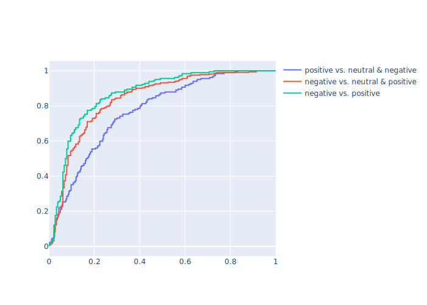
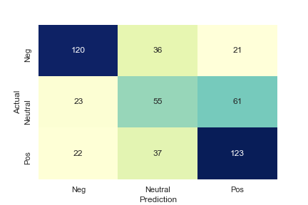

# Twitter Sentiment Stream with Spark

This repository contains the components needed to deploy an advanced sentiment classification model onto the public Twitter sample stream, and handles connecting, processing, classification, and storage with fast and fault-tolerant Spark and multiprocessing solutions.

## Training Data

The first step in an ML project is procuring data, and in this instance, I could not find a dataset that captured the statistics of modern Tweets. This disconnect between training data and real-world data is due to Twitter enforcing its developer terms-of-service, which stipulates that large datasets of users' Tweets cannot be openly shared. The go-to repository for past tweets, then, is the Sentiment140 dataset, which contains 1.6 million labeled tweets. The problem is Sentiment140 was released in 2009, one year before emojis were released and became a huge component of internet communication. Since the release of Sentiment140, no other large dataset has been released that contains emojis, so I decided to synthesize "modern" tweets from this existing dataset.

Work by <a href="https://journals.plos.org/plosone/article?id=10.1371/journal.pone.0144296">Novak et al.</a> provided the information necessary to synthesize "emojified" Tweets, as they collected 1.6 million modern samples, classified their sentiments, and reported the statistical distributions of emoji presence. For each emoji, their frequency in the overall corpus was reported, as well as the proportion of these appearances that were in positive, neutral, and negative Tweets. Thus, I was provided P(sentiment | emoji), but to synthesize data, I would need P(emoji | sentiment). Applying Baye's rule, I found the probability of each emoji appearing in a Tweet given that Tweet's sentiment: 

<i>P(emoji | sentiment) = P(sentiment | emoji) * P(emoji) / P(sentiment)</i>

I stochasically appended emojis to Tweets in the Sentiment140 dataset according to their distribution in modern tweets, then divided the synthesized data into a train and test set, leaving their provided validation set unaltered. Some (cherry-picked) emojified results are shown below. The emojis often do not correspond with the text semantically, but their sentiments seem plausible. Since I am building a statistical model and often these models assume independence between features, the content's relation to the emoji is not an important factor to consider.

* really now, time for sleep.  dreaming of my city, more tattoos, and other great things.  waking up to early morning sociology  😭
* @kamikazekitten How long has he been gone? Hope he comes home to you soon ...  😡
* Is covered in sweet tea  😂
* Recording an Epic Song that will make you wanna Blame it on the Boogie  🙋

The last problem with my training data is that it only contains positive and negative examples, while in the its real-world application, the model will encounter neutral tweets. I did not remedy this with any dataset tricks, but it did coerce my choice in model. 

## Model

For my choice of model, I sought speed, simplicity, and statistical interpretability. This presented two leading candidates: Niave Bayes and Logistic Regression. Their main advantages are:
1. Both of these models are quick to train and quick at prediction, which allows a higher throughput for my stream. 
2. They are both linear models, which prevents overfitting on my large but not too large training data. 
3. They operate with a bag-of-words assumption, which is important because I did not take any context into account when I modified my dataset with emojis. 
4. They output class probabilities, not hard labels. This allows me to infer some confidence in their predictions, which may be used to classify neutral Tweets when the binary classifier is unsure of its label.

Besides model choice, text featurization plays a huge role in classifier accuracy. Various preprocessing and modelling techniques I benchmarked are outlined below:

| Model | Featurization | test AUC |
|-------|---------------|-----------------------|----------------|-----|
| Logistic Regression | adaptive bigrams -> stopword removal -> TF-IDF | 0.885
| Logistic Regression | tokenized -> stopword removal -> stemming -> TF-IDF | 0.833 |
| Logistic Regression | tokenized -> bigrams -> TF-IDF | 0.806 |
| Logistic Regression | tokenized -> trigrams -> TF-IDF| 0.711 |
| Bernoilli Niave Bayes | tokenized -> stopword removal -> stemming -> binary counts | 0.54 |

I chose the top performing-model as per ROC metrics for my stream: Logistic regression with "adaptive bigram" representation. This is tokenization strategy involves extracting bigrams that start with a pre-determined list of words that have contextual importance in bigram form, such as "not" or "no", which often invert the meaning of the following word. This technique transforms the unigram representation of "not", "good" to "not good", while tokenizing all other words to unigrams. This example shows how the strategy converts an ambiguous representation to one which very clearly has negative sentiment. Tokenization was implemented with a regex pattern, speeding up the stream over my previous attempts with NLTK unigram tokenization.

## Evaluation and Tuning

Hyperparameter tuning occured during model selection, but the last step in preparing the model for wild Twitter data is tuning the confidence thresholds for prediction. Using the validation set, which included neutral Tweets, I constructed the ROC curves in Figure 1. The top curve shows classifier strength when determining between negative and positive Tweets, consistent with the data it was trained on. The second curve shows strength when classifying between negative Tweets vs. neutral and positive Tweets, which shows the model is very good a recognizing negative samples. The last curve shows positive vs. pooled negative and neutral samples, and shows the classifier has a much harder time distinguishing positive from neutral Tweets than negative from neutral Tweets. 

By setting the approximate minimum threshold for sensitivity at 0.25, I chose confidence thesholds of 0.45 and 0.71 to assign negative and positive Tweets, while Tweets falling within this range are assumed to be neutral. The result of these trinary classification thresholds is shown in the confusion matrix in Figure 2, which again demonstrates the model's struggles to distinguish neutral and positive Tweets and success in recognizing negative sentiment.

<i> Figure 1.</i>

<i> Figure 2.</i>

## Pipeline Architecture
